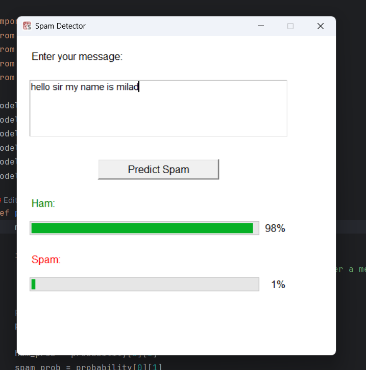

# SMS Spam Detection using Machine Learning

A Machine Learning-based desktop application that detects whether an SMS message is Spam or Ham (Legitimate Message).

This project combines Natural Language Processing (NLP), Machine Learning, and a graphical user interface built with Tkinter to provide real-time spam detection with probability scores.

---

## Features

✅ SMS Spam Detection

✅ Natural Language Processing (NLP)

✅ Text Cleaning and Stopword Removal

✅ Bag of Words (BoW)

✅ TF-IDF Vectorization

✅ Multinomial Naive Bayes Classifier

✅ Interactive Tkinter GUI

✅ Probability Score Visualization

✅ Model Serialization using Pickle

---

## 📸 Application Screenshot




## Demo

The application allows users to:

1. Enter a text message.
2. Click the **Predict Spam** button.
3. View the probability of:

   * Spam
   * Ham (Not Spam)

---

## Project Structure

```text
Sms_spam-detection/
│
├── spam_detector.py
├── spam_detector_ui.py
├── spam_detector.pkl
├── SMSSpamCollection
├── icon/
│   └── spam_detector_icon.ico
├── requirements.txt
├── README.md
└── .gitignore
```

---

## Dataset

This project uses the SMS Spam Collection Dataset.

Dataset contains labeled SMS messages:

| Label | Description                    |
| ----- | ------------------------------ |
| ham   | Legitimate message             |
| spam  | Unwanted or fraudulent message |

Example:

```text
ham    Hey, are we still meeting tonight?
spam   Congratulations! You've won a free iPhone!
```

---

## Machine Learning Pipeline

```text
Raw Text
    ↓
Text Cleaning
    ↓
Lowercase Conversion
    ↓
Punctuation Removal
    ↓
Stopword Removal
    ↓
CountVectorizer (Bag of Words)
    ↓
TF-IDF Transformer
    ↓
Multinomial Naive Bayes
    ↓
Prediction
```

---

## Installation

### Clone the repository

```bash
git clone https://github.com/Milad-Noori/-Sms_spam-detection.git
cd -Sms_spam-detection
```

### Create a virtual environment (Optional)

```bash
python -m venv venv
```

Activate:

Windows:

```bash
venv\Scripts\activate
```

Linux / Mac:

```bash
source venv/bin/activate
```

### Install Dependencies

```bash
pip install -r requirements.txt
```

or

```bash
pip install pandas nltk scikit-learn
```

---

## Download NLTK Resources

Run Python and execute:

```python
import nltk

nltk.download('stopwords')
nltk.download('punkt')
```

---

## Train the Model

```bash
python spam_detector.py
```

This will create:

```text
spam_detector.pkl
```

---

## Run the GUI Application

```bash
python spam_detector_ui.py
```

The desktop interface will launch and allow users to test messages instantly.

---

## Example Predictions

### Spam Example

```text
CONGRATULATIONS! You won a free iPhone. Click here to claim your prize now!
```

Prediction:

```text
Spam: 99%
Ham: 1%
```

### Ham Example

```text
Hey, are we still meeting for dinner at 8pm?
```

Prediction:

```text
Ham: 98%
Spam: 2%
```

---

## Technologies Used

* Python
* Scikit-Learn
* NLTK
* Pandas
* Tkinter
* Pickle

---

## Future Improvements

* Deep Learning-based Spam Detection
* LSTM Networks
* BERT Transformer Models
* Email Spam Detection
* Flask Web Application
* REST API Deployment
* Docker Containerization

---

## Author

**Sayed Milad Noori**

Machine Learning Engineer | AI Developer | Python Developer

GitHub:
https://github.com/Milad-Noori
